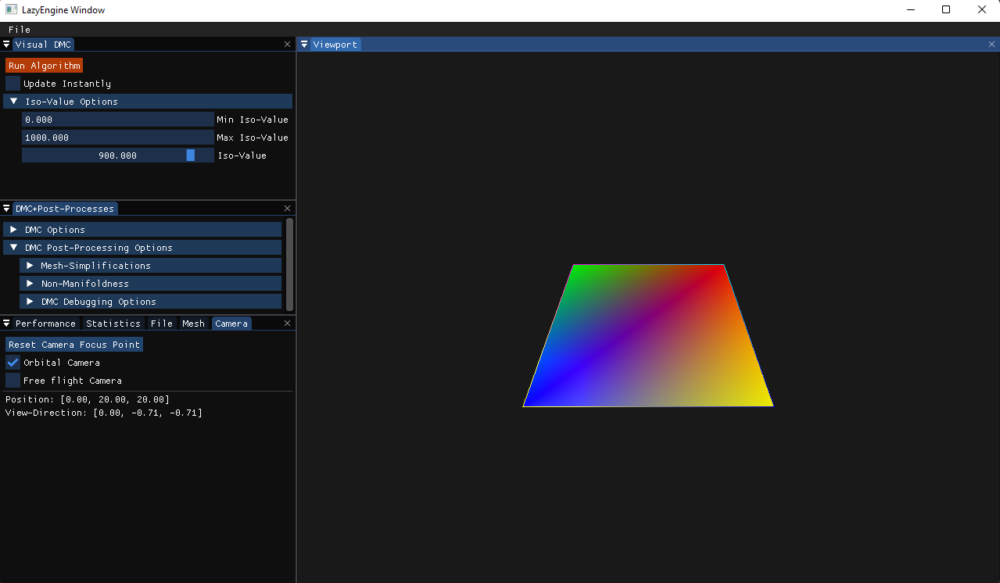
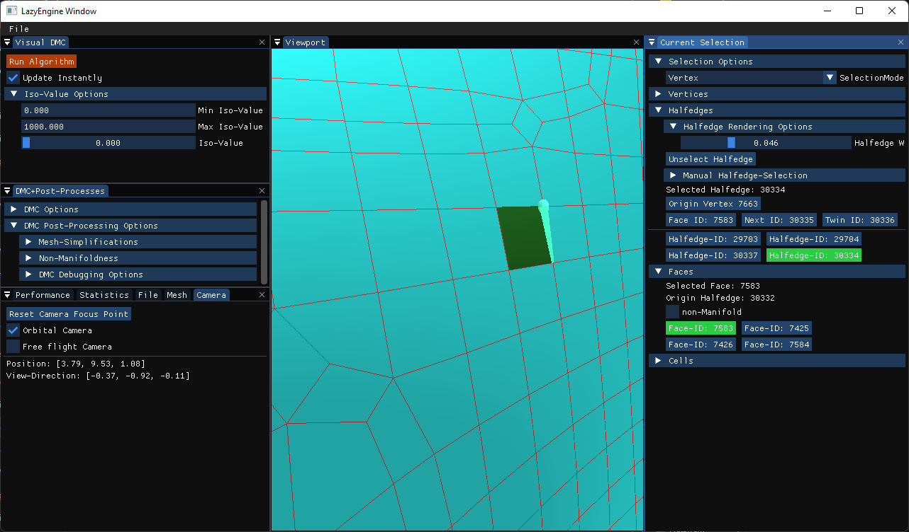

# Manifold Dual Marching Cubes

## Introduction

This Repository's main project `VisualDMC` implements a post-process for the Dual Marching Cubes algorithm, that resolves non-manifold geometry.
The code relies on the `C++17` standard and `CUDA 11.1` or newer (as well as an Nvidia graphics card).
It was written as the Masters-Thesis of Philipp Gürtler at Friedrich-Alexander-Universität Erlangen-Nürnberg.

## Setup

To setup the projects, _CMake 3.18_ or newer is required (For CUDA Compatiblity Reasons).
Currently, this project only supports Windows (or rather, was only tested on a Windows machine).
Depending on the installed Graphics Card, `CMakeLists.txt` might have to be altered to match the card's architecture (check the comments in that file).
A list of values for each major architecture is included right at the point of its usage.
The main project is `VisualDMC`.

### Setup using CMake-Gui on Windows

- Run CMake-Gui and select this directory as source. Choose a `build` folder, preferably in the root directory of this repository. Click `Configure`, then `Generate`. After a successful generation, click `Open Project`.
  A Visual Studio Window should open up.
  Right-Click the project that should be started (probably `DualMarchingCubes/VisualDMC`) and select `Set as startup project`, then building it by selecting `Release` from the Dropdown right next to the `Local Windows-Debugger`-button and clicking said button.

## Running the application

Once the application was built successfully, run it (preferably as a Release-Build for optimized performance).
The application should look like this initially:

The left column contains all kinds of options and information of the camera, mesh, and loaded uniform grid, as well as options for setting the iso-value.
On the right, a dummy surface is displayed in the viewport which can be used to test the viewport controls.

### Loading a grid

Upon startup no uniform grid is loaded into memory.
The `File` Button of the Tool-Bar offers functionality to load uniform grids or generate them from a selection of 3D objects.
By default one part of the post-process is activated: A loaded grid will be padded by 1 in each direction to avoid non manifolds at the grid boundaries.
This feature can be disabled by unticking the corresponding checkbox in the `Load-Grid` dialog.

An optional Grid-Refinement can be set aswell.
This refinement subdivides each cell of the input file as often as the set number implies.
This feature shows what the actual surface would look like if there were more cells to work with.

Both of these options can also be modified on an already loaded grid at the `File`-Tab in the bottom-most area of the left column.

### Running the surface-generating algorithms

To generate a surface from the loaded grid data, first enter an iso-value using the Iso-Value Options.
Hint: ctrl + left-click into the Iso-Value slider allows for a precise input of a value, that may be outside of the range given by the two inputs above.
Then click the reddish `Run Algorithm` button at the top.
If `Update Instantly` is checked, the algorithm will be run automatically on the currently loaded grid as soon as the iso-value, the grid-refinement, or any other option changed.
The result of the surface-generation will be displayed in the viewport.

All post-processes eliminating non-manifold geometry are enabled by default.
They may be disabled in `DMC+Post-Processes > DMC Post-Processing Options`.

### Checking the result

The result of the surface generation will be displayed in the viewport section of the application.
Using the left mouse button the view can be dragged in an orbital fashion around the center of the grid (which is not necessarily the center of the surface generated from said grid).
The mouse-wheel zooms in and out of the mesh.
`WASD` also perform an orbital motion around the mesh, except if the camera is set to `Free flight camera`.
In that case, the camera behaves as a regular First-Person Camera where a mouse pan moves the view direction, while `WASD` move the camera itself through 3D-space.

As soon as a mesh is displayed, a new column opens on the right side of the viewport that handles viewport selections.
Depending on the selection-mode, a right click in the viewport either selects a single vertex or a face.
The menus below offer very rudimentary selection and traversal functionality for debugging the halfedge-structure underneath the visual representation of the mesh.
Warning: This representation is wrong if any of the post-processing steps are skipped.

## References

The original implementation of the Dual Marching Cubes algorithm is taken from [here]https://github.com/rogrosso/tmc.
It has been modified heavily to be integrated into a graphical user interface.

### External libraries

The graphics engine of this project builds upon the code base of the projects listed below.
Some of them have been altered slightly, which is why they are bundled in `LazyEngine/vendors` in this repository.

- [Glad](https://github.com/dav1dde/glad-web)
- [Glfw](https://github.com/glfw/glfw)
- [glm](http://glm.g-truc.net/)
- [imgui](https://github.com/ocornut/imgui)
- [spdlog](https://github.com/gabime/spdlog)
- [stb-image](https://github.com/nothings/stb)

## Publication

D. Zint, R. Grosso, P. Gürtler "Resolving Non-Manifoldness on Meshes from Dual Marching Cubes" Eurographics 2022 (accepted)

